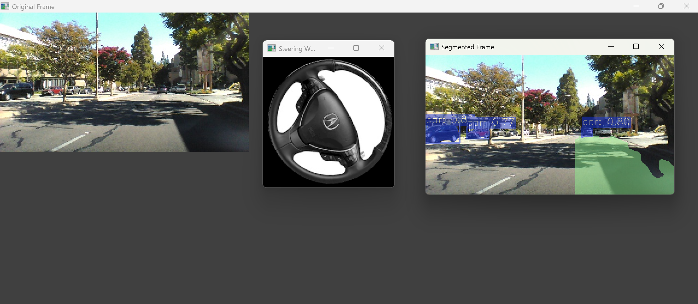

# Self-Driving-Car-Project
A comprehensive implementation of a self-driving car system using deep learning and computer vision techniques. Includes steering angle prediction, lane segmentation, and object detection, with YOLO and CNN models.

## Tech Stack  
- **Programming Language**: Python  
- **Frameworks & Libraries**: TensorFlow, OpenCV, NumPy, Matplotlib  
- **Models**: Custom CNN, YOLO11n, YOLO11n-seg
- 
## Features  
1. **Steering Angle Prediction**  
   - Built and trained a custom Convolutional Neural Network (CNN) architecture.  
   - Achieved:  
     - Loss: 0.5560  
     - MAE: 0.2873  
     - Validation Loss: 0.1929  
     - Validation MAE: 0.2191  

2. **Lane Segmentation**  
   - Trained the YOLO11n-seg model for 20 epochs.  
   - Results:  
     - mAP@0.5: 0.993  
     - mAP@0.5-0.95: 0.933  

3. **Object Detection**  
   - Implemented YOLO11n for real-time object detection of vehicles, pedestrians, and other road elements.  

4. **Visualization**  
   - Concurrently simulated:  
     - Original frame.  
     - Segmented frame.  
     - Steering wheel response based on predicted angles.  

